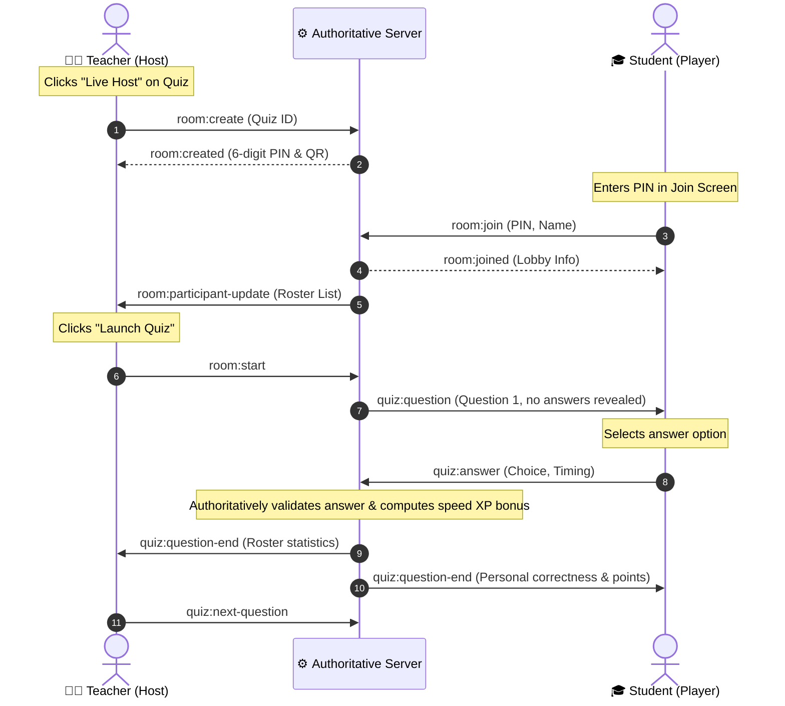

# ⚔️ QuizArena | Learn. Practice. Compete.

QuizArena is a premium, full-stack educational collaborative learning platform that transforms standard DSA and Computer Science practice quizzes into interactive, gamified multiplayer arenas. 

Built around a robust authoritative backend engine, the platform enforces strict role-based access controls and separates dashboards for **Teachers** and **Students** to match classroom dynamics.

---

## 🔑 Sandbox Credentials & Fast Login
Use these credentials on the landing page selector to log in instantly:

> [!TIP]
> **DEVELOPER SHORTCUT:** Use the **Switch Role (🔄)** button at the top right of the navigation header on any dashboard to instantly toggle between accounts!

| Role | Email | Password | Primary Use Case |
| :--- | :--- | :--- | :--- |
| **🧑‍🏫 Teacher Account** | `teacher@quizarena.com` | `password123` | Host live games, manage classes, review reports |
| **🎓 Student Account** | `student@quizarena.com` | `password123` | Play practice mode, enter live room PINs, view XP levels |

---

## 🎭 Dual Portal Options: Teacher vs. Student

QuizArena separates users into two highly specialized experiences:

### 🧑‍🏫 1. The Teacher Dashboard (Instructor Hub)
Designed for classroom projectors, lesson planning, and curriculum tracking.

```
+-----------------------------------------------------------------+
|                         TEACHER SIDEBAR                         |
+-----------------------------------------------------------------+
| [Dashboard] -> [My Quizzes] -> [Create Quiz] -> [Classes]     |
| [Assignments] -> [Question Bank] -> [Reports & Analytics]       |
+-----------------------------------------------------------------+
```

* **📚 Import from Question Bank:** Access pre-curated collections of standard DSA and CS questions from sites like LeetCode and GeeksforGeeks, filtered by topic and difficulty.
* **⚡ AI Question Preparation Assistant:** An integrated compiler assistant where you select a topic keyword and count to automatically auto-fill multiple questions with correct answers, options, and explanations.
* **🎥 Classroom Projector Host View (`/host/:roomCode`):** An high-contrast dark theme projector layout showcasing joined rosters in real-time, active question timers, and an animated 3D podium standings slide.
* **📊 Class Homework Manager:** Lock classes behind access codes, distribute assignments, set due deadlines, limit retry attempts, and export detailed spreadsheet performance reports as CSVs.

---

### 🎓 2. The Student Dashboard (Gamified Portal)
A mobile-first dashboard focusing on practice, review, and status progression.

```
+-----------------------------------------------------------------+
|                       STUDENT BOTTOM MENU                       |
+-----------------------------------------------------------------+
| [Home/Stats] -> [Practice Browser] -> [Join Lobby] -> [Ranks]   |
+-----------------------------------------------------------------+
```

* **🔥 Daily Streaks & XP Progressions:** Prominently displays Flame counters and Level stats based on consecutive daily quiz completions to encourage daily learning.
* **🎯 Practice Browser Engine:** Filter 20 preloaded quizzes across subjects (DBMS, Networks, DSA, OS, Web Dev, Python, C++, Java) and difficulties (Easy, Medium, Hard, Expert).
* **🎮 Authoritative Game Play:** Participate in classic, student-paced, or speed challenge quizzes with instant response validations, countdown rings, and immediate code explanations.
* **🏆 Leaderboard Arena:** Review rankings globally, by college class, or among added friends. Includes an Achievements tab tracking badge status (e.g. "Speed Demon", "Perfect Score").

---

## 🔄 Real-Time Live Quiz Handshake

This diagram shows how Socket.IO coordinates a live classroom competition between the host teacher and active students:



---

## 🛠️ Monorepo Directory Layout

```
quiz-arena/
├── shared/                 # Shared TypeScript models (Quiz, User, Room, Attempt)
│
├── server/                 # Node.js + Express Backend
│   ├── src/
│   │   ├── config/         # Database connection & MongoMemoryServer fallbacks
│   │   ├── controllers/    # API controllers (AI generation, question banks)
│   │   ├── middleware/     # Role-based authorization & JWT validation
│   │   ├── socket/         # Authoritative room handlers (authoritative scoring)
│   │   └── seed.ts         # Database auto-seeder (20 standard subjects quizzes)
│   └── package.json
│
└── client/                 # React + Vite Frontend
    ├── src/
    │   ├── context/        # Authentication & Theme state providers
    │   ├── layouts/        # Dashboard split view layouts (Top Nav, Sidebars)
    │   ├── pages/          # 15+ Custom pages (Quiz Builder, Live Projector, Ranks)
    │   └── services/       # Socket.IO client handshakes & API connectors
    └── package.json
```

---

## 🚀 Running Locally

1. **Verify Ports:** Ensure ports `5000` (Backend API) and `5173`/`5174` (Vite client) are free.
2. **Launch Backend:**
   ```bash
   cd server
   npm run dev
   ```
   *(Automatically boots `mongodb-memory-server` in-memory and seeds quizzes if Mongoose is missing a local daemon).*
3. **Launch Client:**
   ```bash
   cd client
   npm run dev
   ```
4. **Open Portal:** Navigate to [http://localhost:5173/](http://localhost:5173/) to start practicing!
