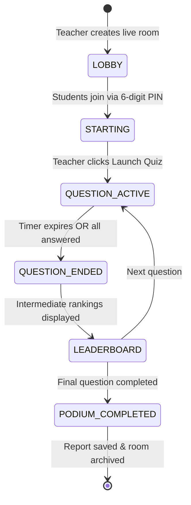

# ⚔️ QuizArena | Learn. Practice. Compete.

<div align="center">

[](https://www.typescriptlang.org/)
[](https://reactjs.org/)
[](https://vitejs.dev/)
[](https://tailwindcss.com/)
[](https://nodejs.org/)
[](https://expressjs.com/)
[](https://socket.io/)
[](https://www.mongodb.com/)

**A modern, full-stack educational quiz platform bridging classroom learning and competitive gaming.**  
Inspired by Wayground, Kahoot, and QuizKhelo with authoritative real-time multiplayer lobbies, AI quiz compilation, question banks, dedicated Teacher & Student dashboards, and a mobile-friendly smartphone mode.

<p align="center">
  <a href="https://suhas-saur.github.io/QuizGround/">
    
  </a>
  <a href="https://github.com/Suhas-Saur/QuizGround">
    
  </a>
</p>

[🌐 Open Live Demo](#-live-demo) • [🎬 60-Second Test Guide](#-interactive-live-multiplayer-demo-walkthrough) • [📱 Mobile Mode](#-mobile-option-mode) • [🧑‍🏫 Teacher Portal](#-1-teacher-dashboard-instructor-hub) • [🎓 Student Portal](#-2-student-dashboard-gamified-learning)

</div>

---

## 🚀 Live Demo

<div align="center">

[](https://suhas-saur.github.io/QuizGround/)

<br />

### 👉 **[CLICK HERE TO OPEN LIVE APPLICATION: https://suhas-saur.github.io/QuizGround/](https://suhas-saur.github.io/QuizGround/)** 👈

</div>

| Portal / Feature | Direct Permanent Live Link | Description |
| :--- | :--- | :--- |
| **🌐 QuizGround Main App** | [**https://suhas-saur.github.io/QuizGround/**](https://suhas-saur.github.io/QuizGround/) | Full landing page with instant sandbox demo access |
| **🧑‍🏫 Teacher Sandbox Login** | [**https://suhas-saur.github.io/QuizGround/#/login**](https://suhas-saur.github.io/QuizGround/#/login) | 1-click instant login button into Teacher Hub |
| **🎓 Student Sandbox Login** | [**https://suhas-saur.github.io/QuizGround/#/login**](https://suhas-saur.github.io/QuizGround/#/login) | 1-click instant login button into Student Practice |
| **🎮 Join Game Lobby by PIN** | [**https://suhas-saur.github.io/QuizGround/#/join**](https://suhas-saur.github.io/QuizGround/#/join) | Mobile tactile keypad to enter 6-digit room PINs |

> [!IMPORTANT]
> **Case Sensitivity:** GitHub Pages repository URLs are case-sensitive. Ensure the path is formatted with capital `Q` and `G`: `https://suhas-saur.github.io/QuizGround/`. All direct links above include the exact casing.

### 🔑 Sandbox Logins (Auto-Seeded & Ready)

> [!TIP]
> **DEVELOPER SHORTCUT:** Use the **Switch Role (🔄)** button at the top right of the navbar on any dashboard to toggle between Teacher and Student accounts instantly without logging in and out!

| Account Type | Email | Password | Preloaded Capabilities |
| :--- | :--- | :--- | :--- |
| **🧑‍🏫 Teacher** | `teacher@quizarena.com` | `password123` | Host live rooms, AI Question Assistant, Question Bank, Homework assignments, Class management, Analytics reports |
| **🎓 Student** | `student@quizarena.com` | `password123` | 20 practice quizzes, streak tracking, XP leaderboards, live room PIN joining, review incorrect answers |
| **🎓 Student 2** | `rahul@quizarena.com` | `password123` | Secondary student account for multi-player lobby testing |
| **🎓 Student 3** | `ananya@quizarena.com` | `password123` | Tertiary student account for competitive leaderboard testing |

---

## 🎬 Interactive Live Multiplayer Demo Walkthrough

Test the real-time Socket.IO multiplayer battle in **under 2 minutes** using two browser tabs:

```
+---------------------------+       Socket.IO       +---------------------------+
|  TAB 1: TEACHER (Host)    |  <=================>  |   TAB 2: STUDENT (Player) |
|  - Creates Room           |       Real-Time       |   - Enters 6-Digit PIN    |
|  - Projector View (QR)    |     Authoritative     |   - Waits in Lobby        |
|  - Controls Game Flow     |        Scoring        |   - Answers in Real-Time  |
+---------------------------+                       +---------------------------+
```

1. **Tab 1 (Teacher Host):**
   * Open [http://localhost:5173/login](http://localhost:5173/login) and log in with `teacher@quizarena.com` / `password123`.
   * On the **Teacher Dashboard**, pick any quiz (e.g. *Algorithms - Practice Set #1*) and click **Live Host**.
   * You will be taken to the **Classroom Projector Host Screen** (`/teacher/host/:code`) displaying a **6-digit Room PIN** and a live **QR Code**.

2. **Tab 2 (Student Player):**
   * Open an **Incognito Window** or second browser tab at [http://localhost:5173/](http://localhost:5173/).
   * Log in with `student@quizarena.com` / `password123` (or click **Join Quiz** from the landing page).
   * Click **Join Quiz** in the navigation bar, type in the 6-digit PIN from Tab 1, and click **Join Room**.

3. **Experience the Live Match:**
   * **Real-time Roster Sync:** Tab 1 instantly displays the student's avatar and name on the projector screen.
   * **Teacher Launches Quiz:** Click **Launch Quiz** on Tab 1. The questions are synchronized to Tab 2 with live animated countdown timers.
   * **Authoritative Scoring:** Submit answers on Tab 2. Faster correct answers automatically earn speed XP bonuses computed strictly on the backend.
   * **Live Standings & Podium:** View animated podium standings and question-by-question breakdown charts.

---

## 🎭 Dual Experience Portals

QuizArena completely separates user interfaces based on role:

```
                                  QuizArena
                                     |
               +---------------------+---------------------+
               |                                           |
      🧑‍🏫 Teacher Portal                           🎓 Student Portal
       ├── AI Quiz Builder                         ├── Practice Catalog (20+ Quizzes)
       ├── Question Bank (LeetCode/GFG)            ├── Gamified XP & Streak HUD
       ├── Classroom Projector (/host/:code)       ├── Live PIN/QR Join Lobby
       ├── Homework & Class Management             ├── Global & Class Leaderboards
       └── CSV Performance Reports                 └── Answer Review & Explanations
```

---

### 🧑‍🏫 1. Teacher Dashboard (Instructor Hub)

Designed specifically for lecture halls, projectors, curriculum planning, and student tracking:

* **⚡ AI Question Preparation Assistant:**
  * Select any topic (e.g., `Arrays`, `Dynamic Programming`, `SQL`).
  * Choose custom question counts (**more than 3**, configurable up to 20 questions) and difficulty (`Easy`, `Medium`, `Hard`, `Expert`).
  * Click **AI Auto-Fill** to instantly compile formatted questions with options, correct answers, and thorough explanations.
* **📚 Integrated Question Bank:**
  * Search curated libraries of standard CS/DSA questions (LeetCode, GeeksforGeeks, Gate, Wayground style).
  * Filter by topic and difficulty, review questions, and check items to import them directly into active drafts.
* **🎥 Classroom Projector Host View (`/teacher/host/:roomCode`):**
  * High-contrast dark theme optimized for auditorium projectors.
  * Large 6-digit PIN and auto-generated QR code for quick mobile scanning.
  * Live participant roster animations with real-time disconnect/reconnect resilience.
* **📊 Class Homework Manager & Assignments:**
  * Group students into custom classes with auto-generated class join codes (e.g., `DSA309`).
  * Assign quizzes as homework with strict start dates, deadlines, and attempt limits.
* **📈 In-Depth Reports & CSV Export:**
  * View question-by-question accuracy percentages, average response times, and identify concepts students struggle with most.
  * One-click CSV export of full classroom grades.

---

### 🎓 2. Student Dashboard (Gamified Learning)

A mobile-responsive portal focused on continuous practice, habit building, and competitive play:

* **🔥 Streak & XP Gamification HUD:**
  * Consecutive day streak tracker with flame animations.
  * XP levels with visual progression bars and unlockable badges (*"First Quiz"*, *"Speed Demon"*, *"Perfect Score"*, *"Top 10"*).
* **🎯 Practice Quiz Engine (QuizKhelo Concept):**
  * Browse and search 20 pre-seeded quizzes across Computer Science disciplines:
    * *Data Structures (Arrays, Linked Lists, Trees, Graphs, Hashing)*
    * *Algorithms (Sorting, Binary Search, Dynamic Programming)*
    * *Operating Systems, Computer Networks, DBMS & SQL*
    * *Web Development (React, JavaScript, Node.js), Python, Java, C++*
  * Multiple Question Types: Multiple Choice, True/False, Multiple Select, Fill-in-the-Blank.
  * Instant feedback mode with detailed step-by-step explanations.
* **🎮 Multiplayer Room Joiner:**
  * Clean keypad interface for entering 6-digit classroom room codes.
  * Camera QR scanner support for mobile devices.
* **🏆 Multi-Tier Leaderboards:**
  * Compare standing **Globally**, within your **Enrolled Class**, or among **Friends**.
  * Filter rankings by Weekly, Monthly, or All-Time points.
* **📝 Question Review & Analytics:**
  * Post-quiz result screens showing score, accuracy %, time taken, correct vs. incorrect breakdown, and recommendations for improvement.

---

### 📱 3. Mobile Option Mode (Smartphone Experience)

A fully optimized mobile layout engineered for one-handed thumb interaction and competitive live play:

* **📱 1-Click Desktop Mobile Simulation:**
  * Toggle between **`📱 Mobile View`** and **`💻 Desktop View`** on desktop browsers anytime.
  * Desktop users can test the mobile view wrapped in an iPhone-style chassis with dynamic island and status bar!
* **🕹️ Tactile On-Screen PIN Keypad:**
  * Large, circular numeric touch buttons (1–9, 0, ⌫ Backspace, Clear) for entering 6-digit room PINs.
  * Eliminates mobile software keyboards bouncing or obscuring the submit button.
  * Automatic submission upon entering the 6th digit.
* **🎮 High-Contrast Gaming Answer Pads:**
  * Kahoot/QuizKhelo-style geometric shape badges (▲ Coral, ◆ Blue, ● Amber, ■ Emerald) with 58px+ touch targets and spring tap feedback (`active:scale-[0.98]`).
* **⚡ Bottom Navigation Bar with Raised Hero Action:**
  * **Student Tab Bar:** 🏠 Home, 📚 Practice, **🎮 Join PIN** *(Center Raised Pulse)*, 🏆 Leaderboards, 👤 Progress.
  * **Teacher Tab Bar:** 📊 Overview, 📚 Quizzes, **⚡ Create Quiz** *(Center Raised Pulse)*, 👥 Classes, 📈 Reports.
* **🔥 Horizontal Fast-Action Rail:**
  * Swipeable touch pills on mobile dashboard for 1-tap jumping to games, practice, and streak status.

---

## 🔄 Socket.IO Live Game State Machine



### Real-Time Authoritative Event Protocol

| Event Name | Direction | Payload | Purpose |
| :--- | :--- | :--- | :--- |
| `room:create` | Client ➔ Server | `{ quizId, settings }` | Teacher requests live lobby generation |
| `room:join` | Client ➔ Server | `{ roomCode, studentId, name }` | Student enters 6-digit PIN |
| `room:participant-update` | Server ➔ Client | `{ participants, count }` | Broadcasts joined player list to lobby |
| `room:start` | Client ➔ Server | `{ roomCode }` | Teacher initiates game countdown |
| `quiz:question` | Server ➔ Client | `{ question, options, timer, index }` | Broadcasts current question (answers stripped) |
| `quiz:answer` | Client ➔ Server | `{ questionIndex, answer, timeTaken }` | Student submits selected answer |
| `quiz:question-end` | Server ➔ Client | `{ correctAnswer, explanation, stats }` | Server reveals answers & computes speed XP |
| `quiz:leaderboard` | Server ➔ Client | `{ standings: [...] }` | Broadcasts live ranked leaderboard |
| `quiz:end` | Server ➔ Client | `{ podium, finalScores }` | Final game completion and podium event |

---

## 🛠️ System Architecture & Tech Stack

```
QuizArena/
├── shared/
│   └── types.ts            # Shared TypeScript interfaces (User, Quiz, Question, Room, Attempt)
│
├── server/                 # Express, Node.js, Socket.IO, Mongoose
│   ├── src/
│   │   ├── config/db.ts    # Dual DB: MongoMemoryServer (in-memory zero setup) + MongoDB Atlas
│   │   ├── controllers/    # Auth, Quizzes, Question Bank, Rooms, Attempts, Classes, Reports
│   │   ├── middleware/     # JWT verification & role authorization (Student/Teacher)
│   │   ├── models/         # 8 Mongoose models (User, Quiz, Room, Class, Assignment, etc.)
│   │   ├── services/       # AI Generator & Question Bank services
│   │   ├── socket/         # Authoritative room & scoring event controllers
│   │   └── seed.ts         # Seeder: 20 comprehensive subject quizzes & test users
│   └── package.json
│
└── client/                 # React 18, Vite, Tailwind CSS, Recharts, Framer Motion
    ├── src/
    │   ├── context/        # AuthContext (sessions) & ThemeContext (Light/Dark mode)
    │   ├── layouts/        # DashboardLayout (role-aware sidebars, Switch Role toggle)
    │   ├── pages/          # 15 Custom Views (Landing, Dashboards, Builder, Host, Practice, etc.)
    │   └── services/       # Axios API client & Socket.IO singleton
    └── package.json
```

---

## 🚀 Running Locally from Scratch

### Prerequisites
* **Node.js**: v18.0 or higher
* **npm**: v9.0 or higher
* *(Optional)* MongoDB Community Server or MongoDB Atlas (if not installed, `mongodb-memory-server` boots automatically in RAM!).

### 1. Clone the Repository
```bash
git clone https://github.com/Suhas-Saur/QuizGround.git
cd QuizGround
```

### 2. Configure Environment Variables
Copy `.env.example` to both root and `server/.env`:
```bash
PORT=5000
MONGODB_URI=mongodb://localhost:27017/quizarena
JWT_SECRET=quizarena_super_secret_jwt_key_987654321
CLIENT_URL=http://localhost:5173
```

### 3. Install Dependencies
```bash
# Install Server Dependencies
cd server
npm install

# Install Client Dependencies
cd ../client
npm install
```

### 4. Run Development Servers
Open two terminal windows:

**Terminal 1 (Backend Server):**
```bash
cd server
npm run dev
```
*Server runs on `http://localhost:5000`. On first run, it automatically populates in-memory collections with 20 demo quizzes, mock teachers, and mock students.*

**Terminal 2 (Frontend Client):**
```bash
cd client
npm run dev
```
*Vite client starts on `http://localhost:5173`.*

---

## 🚢 Production Deployment

This project is deployed independently from the local development environment and does not depend on localhost, Antigravity, or temporary tunnels.

* **Production Live App:** [https://suhas-saur.github.io/QuizGround/](https://suhas-saur.github.io/QuizGround/)
* **Direct Sandbox Access:** [https://suhas-saur.github.io/QuizGround/#/login](https://suhas-saur.github.io/QuizGround/#/login)
* **Hosting Platform:** GitHub Pages (Automated via `gh-pages` branch)
* **Repository:** [https://github.com/Suhas-Saur/QuizGround](https://github.com/Suhas-Saur/QuizGround)

### Continuous Deployment (CI/CD) Workflow
The deployment architecture is fully configured:
```
GitHub Push to main
   ├──> Production Build (tsc && vite build with BASE_URL=/QuizGround/)
   ├──> 404.html SPA Fallback Injection
   ├──> Automated Publish via GitHub Actions (.github/workflows/deploy.yml)
   └──> Permanent Live URL: https://suhas-saur.github.io/QuizGround/
```

### Deploying Frontend to Vercel
Vercel configuration is pre-configured via root [`vercel.json`](vercel.json):
1. Import repository `https://github.com/Suhas-Saur/QuizGround` on [vercel.com](https://vercel.com).
2. Set root directory to `.` (or `client`).
3. Build command: `npm run build` (auto-detected).
4. Output directory: `client/dist`.
5. Environment variable: `VITE_API_URL=https://quizarena-api.onrender.com`.

### Deploying Backend to Render / Railway
Render service is pre-configured via [`render.yaml`](render.yaml):
1. Connect repository on [render.com](https://render.com) using Blueprint (`render.yaml`).
2. Set environment variables:
   * `PORT=5000`
   * `MONGODB_URI=<your_mongodb_atlas_uri>` (uses in-memory fallback if not provided)
   * `JWT_SECRET=<your_secure_secret>`
   * `CLIENT_URL=*` (or `https://suhas-saur.github.io,https://quizground.vercel.app`)

---

## 📄 License & Attribution
QuizArena is open-source educational software distributed under the [MIT License](LICENSE).
Built with ❤️ for teachers, learners, and competitive coders worldwide.
